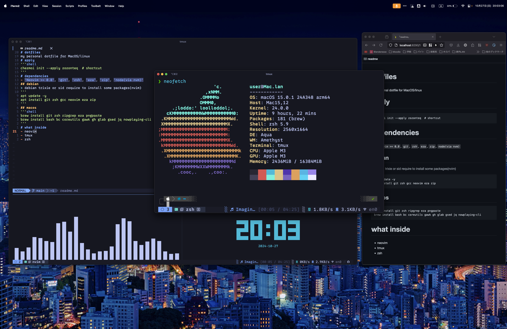

# dotfiles

my personal dotfile for MacOS/linux
# apply
```shell
chezmoi init --apply zozonteq  # shortcut
```
# dependencies
- `Neovim >= 0.8`, `git`, `zsh`, `eza`, `zip`, `node(via nvm)`
## debian
> debian trixie or sid require to install some packages(nvim)
```
apt update -y
apt install git zsh gcc neovim eza zip 
```
## macos 
```shell
brew install git zsh ripgrep eza pngpaste starship
brew install bash bc coreutils gawk gh glab gsed jq nowplaying-cli
```
# what inside
- neovim
- tmux
- zsh
